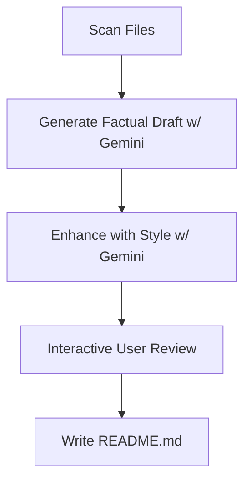
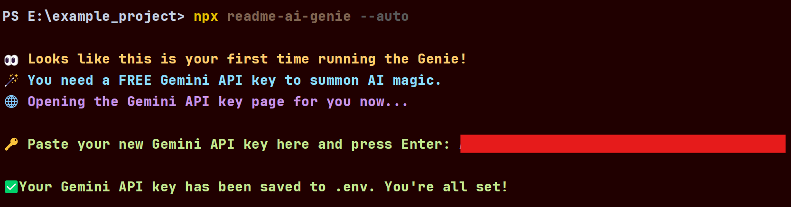
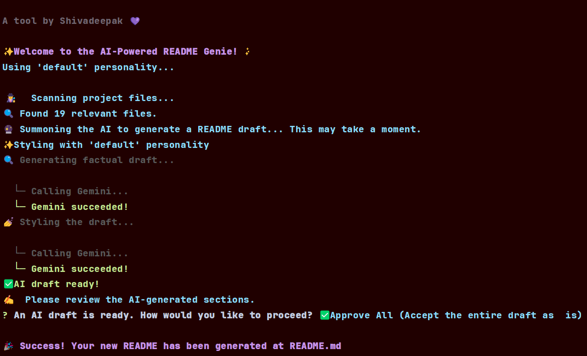

# 🧞‍♂️ readme-ai-genie 🔮✨

[](https://www.npmjs.com/package/readme-ai-genie)         [](LICENSE)
## VERSION 2 COMING SOON... WITH A CREW OF AI and BUG FIXES 
> **Your project’s personal AI stylist for killer documentation.** > 🪄 From skeleton code to storybook-ready—let our AI genie craft and style your README like a pro, powered by Google Gemini.

---
## 📚 Table of Contents
1. [What is This?](#-what-is-this)
2. [How It Works](#-how-it-works)
3. [Features](#-features)
4. [Installation & Setup](#-installation--setup)
5. [Usage & Commands](#-usage--commands)
6. [Tech Stack](#-tech-stack)
7. [Contributing](#-contributing)
8. [License](#-license)

---
## 🤔 What is This?
`readme-ai-genie` is a smart CLI tool that acts as your co-creator for documentation. It scans your project's codebase, understands its structure and dependencies, and then uses a powerful two-step AI pipeline with Google Gemini to generate a beautiful, professional, and personality-driven `README.md` file, which you can then approve or edit section-by-section.

---
## 💡 How It Works

This genie runs a **two‑step AI symphony** to ensure your README is both accurate and stylish:

1. **The Architect 🏗️**
   It first scans your project files (smartly ignoring junk), then summons Gemini to draft a **factually precise**, well‑structured README.
2. **The Stylist 💅**
   It then takes that blueprint back to Gemini with a “glow‑up” prompt—injecting **tone**, **emojis**, and **flair**—so your README goes from bland to **brand**.

<details><summary>Click to peek under the hood 🔍</summary>


</details>

---

## ✨ Features

* **🤖 Dual AI Pipeline:** Uses Google Gemini for both a structured first draft and a creative final polish.
* **🎨 Selectable Personalities**: Give your README a unique voice! Choose from a curated list of AI personalities to match your project's vibe.
* **🕵️ Smart File Scanning**: Intelligently scans your project, respecting your `.gitignore` for a clean and relevant context.
* **✍️ Interactive Review**: You're the director. Approve, edit, or discard each AI-generated section on the fly for ultimate control.
* **🔐 Effortless First-Time Setup**: The "Royal Concierge" flow helps new users get and save their API key automatically.
* **🚀 Pro CLI UX**: Comes with standard flags like `--help`, `--version`, and `--output` for a seamless developer experience.

---

## 🚀 Installation & Setup

1.  **Install the Tool:**
    The recommended way is to use `npx`, which runs the package without a permanent install. No setup is needed beyond having Node.js (v18+) installed.

2.  **API Key Configuration:**
    The very first time you run `readme-ai-genie`, it will detect that you don't have a Google Gemini API key.
    * It will automatically open your browser to the Google AI Studio page.
    * It will then prompt you to paste the key directly into your terminal.
    * It will create a `.env` file in your project root and securely save the key for all future uses.

    

---

## 💻 Usage & Commands

All commands are run via `npx` from the root of your project.

### The Main Spell
This is the core command to generate a README with the default personality.

```bash
npx readme-ai-genie --auto
```


---
### Command Variations

#### Get Help
Displays the list of all available commands and options.

```bash
npx readme-ai-genie --help
```

#### Check Version
Shows the currently installed version of the tool.

```bash
npx readme-ai-genie --version
```

#### List Available Styles
Displays the "fashion mood board" of all available AI personalities you can use.

```bash
npx readme-ai-genie --styles
```


#### Generate with a Specific Vibe
Use the `--style` flag to command the genie to write with a different personality.

```bash
npx readme-ai-genie --auto --style radiant
```

#### CI/CD & Automation (Auto-Approve)
Use the `--yes` flag to skip the entire interactive review process. The AI's first draft will be saved directly. Perfect for automated workflows.

```bash
npx readme-ai-genie --auto --yes
```

#### Custom Output Path
Use the `-o` or `--output` flag to save the final `README.md` to a specific file or folder.

```bash
npx readme-ai-genie --auto -o docs/PROJECT_README.md
```

---

## 🛠️ Tech Stack
* **Runtime**: Node.js (v18+)
* **AI**: `@google/generative-ai` (Google Gemini)
* **CLI Prompts**: `inquirer`
* **Styling**: `chalk`
* **File Globbing**: `fast-glob` + `ignore`
* **Env Management**: `dotenv`
* **Browser Opener**: `open`

---
## 🤝 Contributing
Your ideas make this genie even more magical! ✨ Contributions are welcome. Fork the repo, create a branch, and open a PR. Please review our (soon-to-be-written) `CONTRIBUTING.md` and `CODE_OF_CONDUCT.md`.

---
## 📜 License
MIT License © 2025 Shivadeepak

---
## 🧠 Dev Quote
> “First, solve the problem. Then, write the code. Finally, let the genie write the README.”
