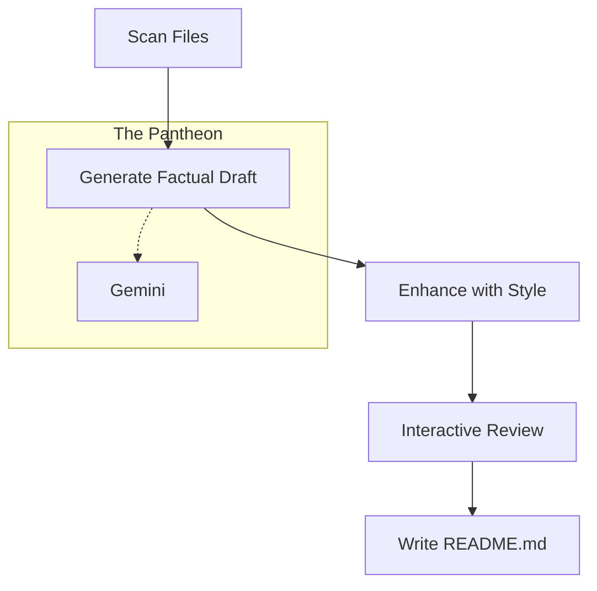

# 🧞‍♂️ readme-ai-genie 🔮✨

[](https://www.npmjs.com/package/readme-ai-genie)
[](LICENSE)

> **Your project’s personal AI stylist for killer documentation.**
> 🪄 From skeleton code to storybook-ready—let our AI genie craft and style your README like a pro (powered by Google Gemini).

---

## 📚 Table of Contents

1. [How It Works](#-how-it-works)
2. [Features](#-features)
3. [Tech Stack](#-tech-stack)
4. [Installation & Setup](#-installation--setup)
5. [Usage](#-usage)
6. [Contributing](#-contributing)
7. [License](#-license)
8. [Dev Quote](#-dev-quote)

---

## 💡 How It Works

This genie runs a **two‑step AI symphony**:

1. **The Architect 🏗️**
   It first scans your project files (smartly ignoring junk), then invokes **Google Gemini** to draft a **factually precise**, well‑structured README.

2. **The Stylist 💅**
   It then applies a “glow‑up” prompt—injecting **tone**, **emojis**, and **flair**—so your README goes from bland to **brand**.

<details><summary>Click to peek under the hood 🔍</summary>



</details>

---

## ✨ Features

* 🤖 **Single AI Powerhouse (Google Gemini)**: Fast, reliable drafting with one best-in-class model.
* 🎨 **Selectable Vibes**: Choose a "vibe" for your README! Run `readme-genie --styles` to see personalities like *goddess*, *zen*, or *quirky*.
* 🕵️ **Smart File Scanning**: Respects `.gitignore` for a clean, relevant context.
* ✍️ **Interactive Review**: Approve, edit, or discard each section for ultimate control.
* 🔐 **Secure by Design**: Manages API keys via `.env`, no keys checked into source control.
* 🚀 **Pro CLI UX**: Standard flags like `--help`, `--version`, `--output`, and `--styles` for seamless usage.

---

## 🛠️ Tech Stack

* **Runtime**: Node.js (v18+)
* **AI**: `@google/generative-ai` (Gemini)
* **CLI Prompts**: `inquirer`
* **Styling**: `chalk`
* **File Globbing**: `fast-glob` + `ignore`
* **Env Management**: `dotenv`

---

## 🚀 Installation & Setup

### 🔽 Clone the Repository:

```bash
git clone https://github.com/shivadeepak99/readme-ai-genie.git
cd readme-ai-genie
```

### 📦 Install Dependencies:

```bash
npm install
```

### 🔐 Configure Your API Key:

Create a `.env` file:

```bash
cp .env.example .env
```

Then add your Google Gemini key:

```env
GEMINI_API_KEY=your_gemini_api_key
```

---

## 💻 Usage

### ✨ Generate a README

```bash
npx readme-ai-genie --auto
```

### 💅 Generate with a Specific Vibe

```bash
npx readme-ai-genie --auto --style goddess
```

### 🎨 List All Available Styles

```bash
npx readme-ai-genie --styles
```

### 🤖 CI/CD Friendly (Auto-Approve All)

```bash
npx readme-ai-genie --auto --yes
```

### 📄 Custom Output Path

```bash
npx readme-ai-genie --auto -o docs/README.md
```

---

## 🤝 Contributing

✨ Contributions are welcome! Fork the repo, create a branch, and open a PR. Please review `CONTRIBUTING.md` and `CODE_OF_CONDUCT.md`.

---

## 📜 License

MIT License © 2025 Shivadeepak99

---

## 🧠 Dev Quote

> “First, solve the problem. Then, write the code. Finally, let the genie write the README.”
